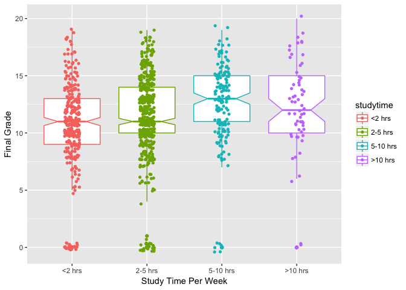

Introduction
------------

Here is an example of how you can leverage Github to collaborate on a project. I have 'cloned' your repository on local machine and now adding a markdown document that you will be able to accept once I create the pull request. Once I cloned your repository, I got all your code and folders which exist in the Capstone repository. I am going to use that to make this tutorial in R.

Please note the YAML part of the .Rmd document. If you notice I have changed the output to render a document suitable for github. When I knit this document, it will create an additional folder containing all the figures and also a new .md file with the same name. By default, the .Rmd file will not contain any figures when you push it to Github. It is the .md file which contains the figures.

Performing Analysis Of Variance (ANOVA) Test in R
-------------------------------------------------

I am going to start off by reading in the data and carrying out the steps that you have implemented in your code.

``` r
library(tidyverse)

d_math <- read.csv2("student-mat.csv")
d_port <- read.csv2("student-por.csv")

# How many students are enrolled in both math and Portuguese? Merge based on attributes not associated with course.
d_both <- merge(d_math, d_port, by=c("school", "sex", "age", "address", 
                "famsize", "Pstatus", "Medu", "Fedu", "Mjob", "Fjob",
                "reason", "guardian", "traveltime", "activities", "nursery",
                "higher", "internet", "romantic", "famrel", "freetime", 
                "goout", "Dalc", "Walc", "health", "absences"))

# Tidy up variable types, labels of variables
d_math$studytime <- factor(d_math$studytime, labels = c("<2 hrs", "2-5 hrs", "5-10 hrs", ">10 hrs"))
d_port$studytime <- factor(d_port$studytime, labels = c("<2 hrs", "2-5 hrs", "5-10 hrs", ">10 hrs"))
d_math$Medu <- factor(d_math$Medu, labels = c("none", "primary", "upper primary", "secondary", "higher"))
d_port$Medu <- factor(d_port$Medu, labels = c("none", "primary", "upper primary", "secondary", "higher"))
d_math$Fedu <- factor(d_math$Fedu, labels = c("none", "primary", "upper primary", "secondary", "higher"))
d_port$Fedu <- factor(d_port$Fedu, labels = c("none", "primary", "upper primary", "secondary", "higher"))
d_math$traveltime <- factor(d_math$traveltime, labels = c("<15 min", "15-30 min", "30 min-1 hr", ">1 hr"))
d_port$traveltime <- factor(d_port$traveltime, labels = c("<15 min", "15-30 min", "30 min-1 hr", ">1 hr"))
  
# Create complete dataset d_total: combine math and Portuguese datasets with "course" as variable

course <- rep("math", times = length(d_math$school))
d_math <- cbind(d_math, course)

course <- rep("port", times = length(d_port$school))
d_port <- cbind(d_port, course)

d_total <- rbind(d_math, d_port)

#Its a good practice to remove variables that are no longer needed
rm(d_math,d_port,d_both,course)
```

As you would have perhaps read by now, whenever we wish to test a categorical explanatory variable with a quantitative response variable, ANOVA is the test to be used. The categorical explanatory variable is generally referred to as *factor* and each factor should have 2 or more *levels*. Also, when we have a single factor variable, we use a one-way ANOVA **if there are 3 or more levels**. If we had a single factor with just two levels, for example sex would generally have only Male and Female, in that case we use another test known as the Student's t test. You can read more about it in chapter 11 of the book I have attached.

Let us start off by having a look at the relationship between `studytime` and `G3`, with the former being the explanatory variable and the latter being the quantitative response variable. Intutively, I would think, that the more you study, the better your scores would be. Let's see this with a box plot.

``` r
ggplot(d_total, aes(x=studytime, y=G3,colour=studytime)) +
  geom_boxplot(notch = T) +
  xlab("Study Time Per Week") + ylab("Final Grade")+
  geom_jitter(shape=16, position=position_jitter(0.1))
```



Median final grade is the lowest for the 2-5 hour group and is comparable to the less than 2 hour group. Also median final grade is the highest for the 5-10 hours group rather than the greater than 10 hours group as I expected. However, the picture is not very clear when it comes to the levels being significantly different from each other. Analysis of variance will answer these questions.

ANOVA test helps us to compare means by comparing variances. I know it sounds strange, but that's how one way ANOVA works. Let's have a look at means and variances of `studytime`.

``` r
by(d_total$G3,d_total$studytime,mean)
```

    ## d_total$studytime: <2 hrs
    ## [1] 10.58044
    ## -------------------------------------------------------- 
    ## d_total$studytime: 2-5 hrs
    ## [1] 11.33598
    ## -------------------------------------------------------- 
    ## d_total$studytime: 5-10 hrs
    ## [1] 12.49383
    ## -------------------------------------------------------- 
    ## d_total$studytime: >10 hrs
    ## [1] 12.27419

``` r
by(d_total$G3,d_total$studytime,var)
```

    ## d_total$studytime: <2 hrs
    ## [1] 15.14303
    ## -------------------------------------------------------- 
    ## d_total$studytime: 2-5 hrs
    ## [1] 14.23151
    ## -------------------------------------------------------- 
    ## d_total$studytime: 5-10 hrs
    ## [1] 13.09623
    ## -------------------------------------------------------- 
    ## d_total$studytime: >10 hrs
    ## [1] 17.84162

While analysing variance, we will look at the response variable, `G3` in our case, and separate it into two parts - explained variation and unexplained variation. This is mathematically represented as *S**S**Y* = *S**S**A* + *S**S**E*. Explained variation is SSA also called *treatment sum of squares* and *S**S**E* is the *error/residual sums of squares*.

### Calculate SSY

While the above may sound a bit confusing, it's best to work it out ourselves to see the results. Let's start by calculating *S**S**Y*.

``` r
sum((d_total$G3 - mean(d_total$G3))^2)
```

    ## [1] 15578.92

### Calculate SSE

The unexplained variation, *S**S**E*, is calculated from the differences between `G3` and the mean `G3` for that particular `studytime`. For individual levels of `studytime` we can calculate using the `by()` function:

``` r
by(d_total$G3,d_total$studytime,function (x) sum((x-mean(x))^2) )
```

    ## d_total$studytime: <2 hrs
    ## [1] 4785.199
    ## -------------------------------------------------------- 
    ## d_total$studytime: 2-5 hrs
    ## [1] 7144.219
    ## -------------------------------------------------------- 
    ## d_total$studytime: 5-10 hrs
    ## [1] 2108.494
    ## -------------------------------------------------------- 
    ## d_total$studytime: >10 hrs
    ## [1] 1088.339

And the total *S**S**E* can be calculated as:

``` r
sum(by(d_total$G3,d_total$studytime,function (x) sum((x-mean(x))^2) ))
```

    ## [1] 15126.25

The extent to which *S**S**E* is less than *S**S**Y* is a reflection of the magnitude of the differences between the means. The greater the difference between the mean final grade on the different types of study time, the greater will be the difference between SSE and SSY. This is the basis of analysis of variance. We can make inferences about differences between means by looking at differences between variances (or between sums or squares, to be more precise at this stage).

The difference between *S**S**Y* and *S**S**E* is called the treatment sum of squares *S**S**A* and this is the amount of variation in final grade that is explained by the difference between the means of different study times. In our case this value turns out to be 452.67.

### Degrees Of Freedom

There are a total of 1044 observations out of which the distributions are 317, 503, 162 and 62 for the respective study times. Since we already have the means of these available, the degrees of freedom will be one less, ie. (317-1), (503-1), (162-1) and (62-1) which totals 1040 degrees of freedom. These are the degrees of freedom for the error or residual terms. Similalry since there are 4 different types of study times, the degrees of freedom are 4-1, which is 3.

Mean squares are obtained by dividing each sum of squares by it's respective degree of freedom. Try calculating it manually.

Another important parameter to note is the F ratio. This is the variance of study time divided by the error variance. In our case this is 150.89/14.54 which turns out to be 10.3775791. This ratio tests the null hypothesus that the means of the study times is the same. If we reject this null hypothesis, then we accept the alternate hypothesis that at least one of the means is different. The question obviously is that what does this value really signify? If this value is a 'big' number, we will reject the null hypothesis. Given that there are 3 degrees of freedom in the numerator and 1040 in the denominator, we can compare it with a **critical value**. We can determine this critical value by using the `qf()` function which gives us quantiles of the F distribution.

``` r
qf(0.95, 3,1040)
```

    ## [1] 2.613461

Since 10.37 is much greater than this critical value of 2.61, hence we can reject the null hypothesis. We can also calculate the p-value associated with this critical value of 2.61. Instead of using the function for quantiles of the F distribution, we can use the `pf()` function for cummulative probabilities.

``` r
1 - pf(10.37,3,1040)
```

    ## [1] 9.982482e-07

This value means that a value of F=10.37 or bigger would arise by chance alone when the null hypothesis was true about 0.992 times out of 1 million! Hence we reject the null hypothesis.

### Doing it all with aov()

All the hard work can be replaced by this one line of code:

``` r
summary(aov(d_total$G3~d_total$studytime))
```

    ##                     Df Sum Sq Mean Sq F value   Pr(>F)    
    ## d_total$studytime    3    453  150.89   10.37 9.92e-07 ***
    ## Residuals         1040  15126   14.54                     
    ## ---
    ## Signif. codes:  0 '***' 0.001 '**' 0.01 '*' 0.05 '.' 0.1 ' ' 1

I hope you can now correlate the results obtained here and what we have done earlier.
